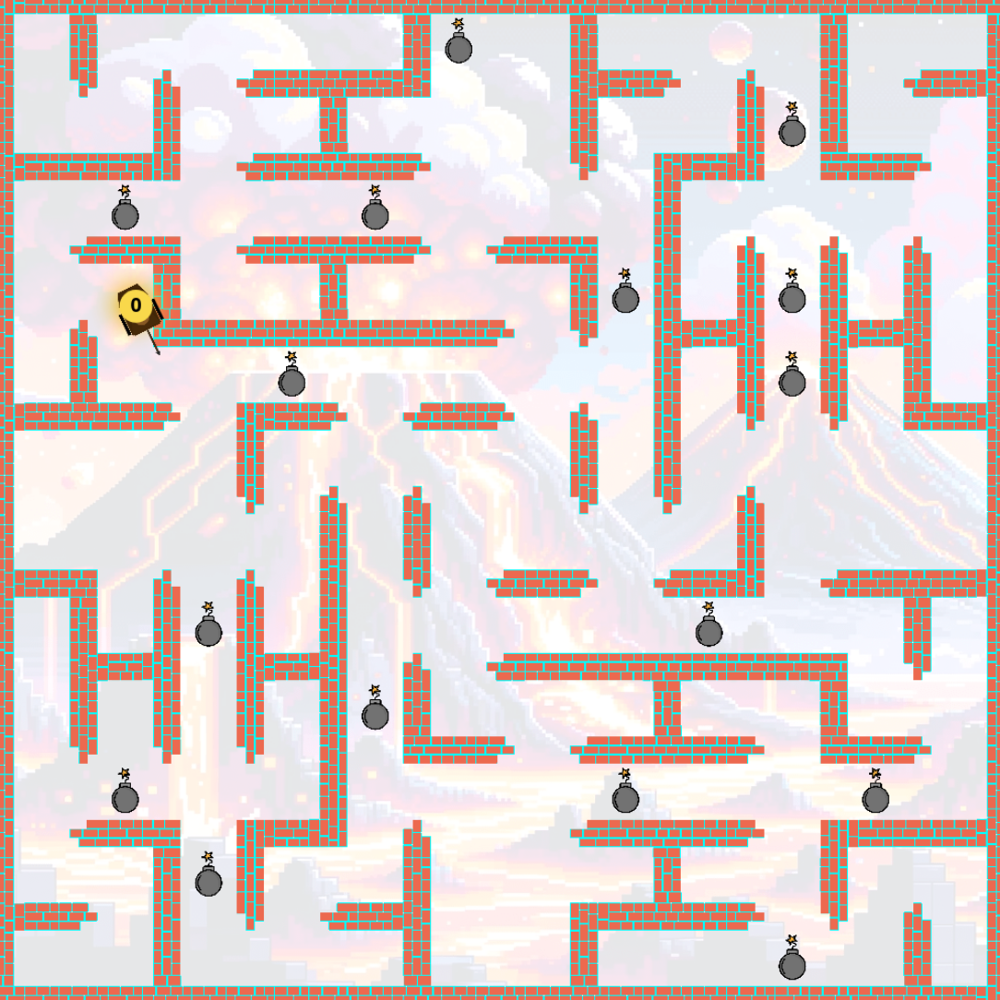
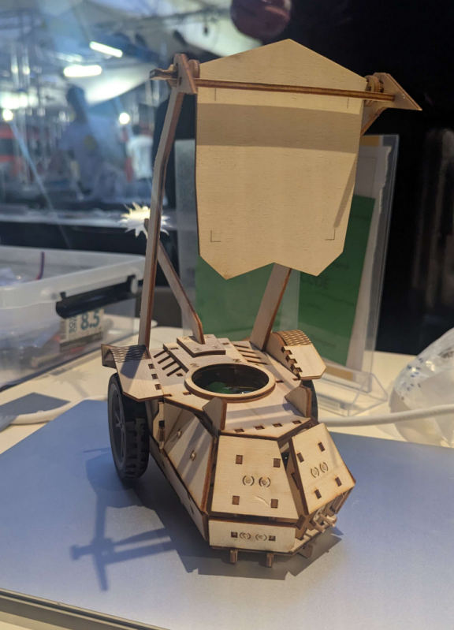
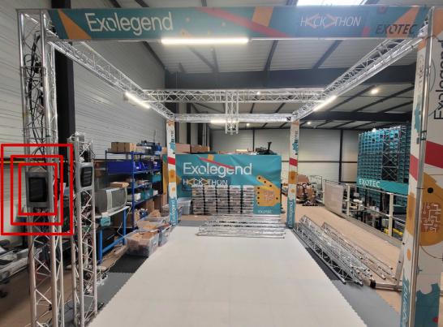

# Exolegend #3


## Overview 

[Exolegend #3](exolegend.com) is a robotics programming competition organized by [Exotec](https://www.exotec.com/), a leading French industrial robotics company. It took place from March 7 to 9, 2025, at the Matmut Stadium Gerland in Lyon with over 150 participants, including students and professionals

The goal was to program a Gladiator algorithm (Robot fighting in an arena) following defined rules. They had to maximize the team's territory by coloring grid cells using bombs and eliminating opposing robots within a 120-second match. Strategic use of bombs and navigation skills are essential to outmaneuver opponents and secure victory.



And for sure, we had to use real robots in real arena :)





## Program Overview:

**Day 1** (March 7): Participants arrived, assembled their robots, and installed the Exolegend software. The day concluded with a conference evening discussing the future of robotics.

**Day 2** (March 8): Teams refined their strategies, engaged in intensive training sessions, and finalized robot adjustments.

**Day 3** (March 9): Qualification matches took place, followed by the finals and an awards ceremony. The event concluded with a closing ceremony and prize distribution.

For more precise informations, please refers to [competition's README](STARTER_README.rst)

## Prerequisites

- PlatformIO: Ensure that PlatformIO is installed in your environment to compile and run the programs. PlatformIO is used to manage the build and launch of the client.


## Installation & Usage

### 1. Compile the project
```bash
pio run -e simu
```

### 2. Launch virtual machine

1. Clone the repository:
    ```bash
    git clone https://github.com/Davphla/exolegend-virtual-machine.git
    cd exolegend-virtual-machine
    ```

2. Launch the virtual machine:
    ```bash
    ./launch_virtual.sh
    ```
Once this script is run, the simulation should be accessible via your web browser.

### 3. Launching Robots
 This script will start the robot's AI and connect it to the virtual machine. The term "Ghost" refers to the simulated robot used in the competition.

```bash
./ghost.sh
```

## Useful links

- [Exolegend](https://www.exolegend.com/) - Current edition
- [Exolegend Wayback machine](https://web.archive.org/web/20250306073651/https://www.exolegend.com/) - 2025 edition
- [Gitlab](https://gitlab.com/exolegend/exolegend)
